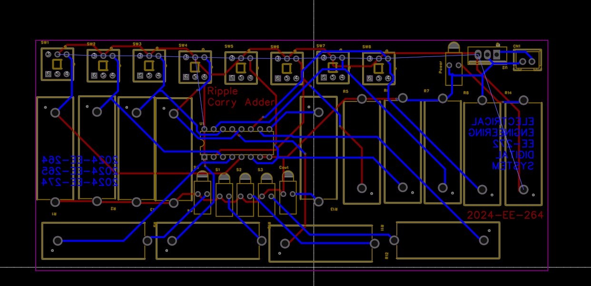
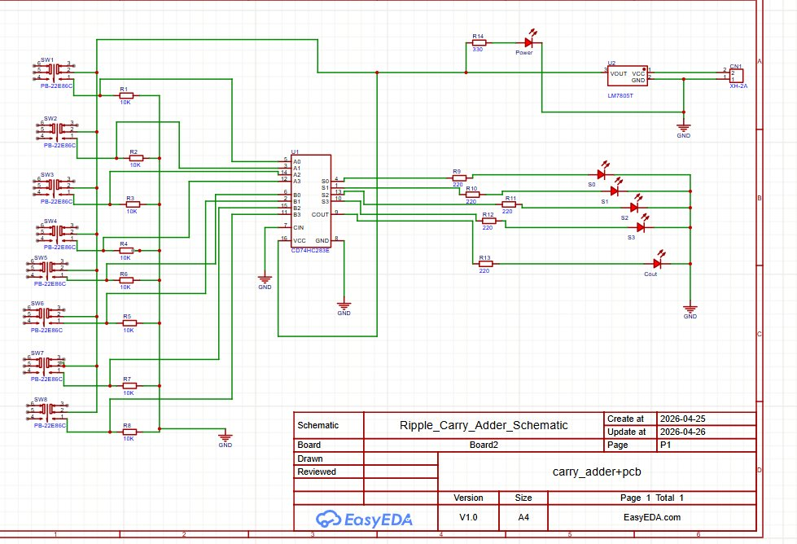
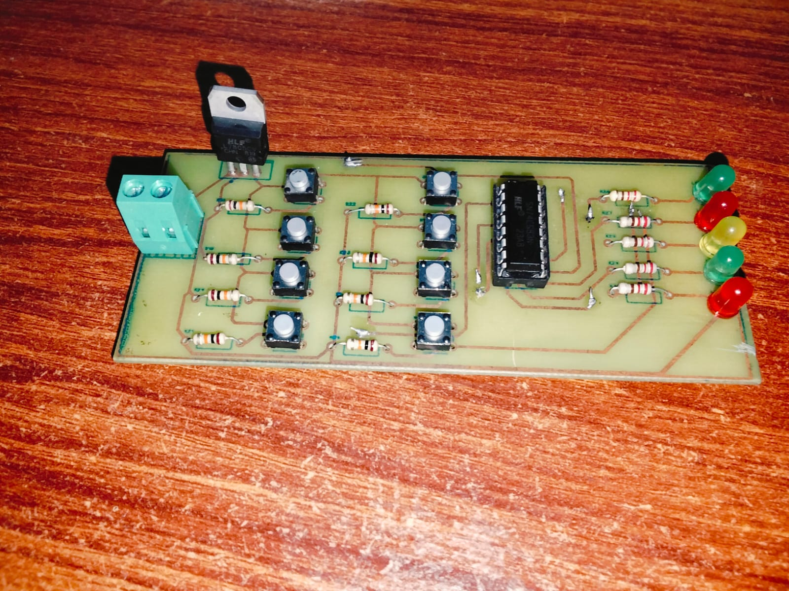
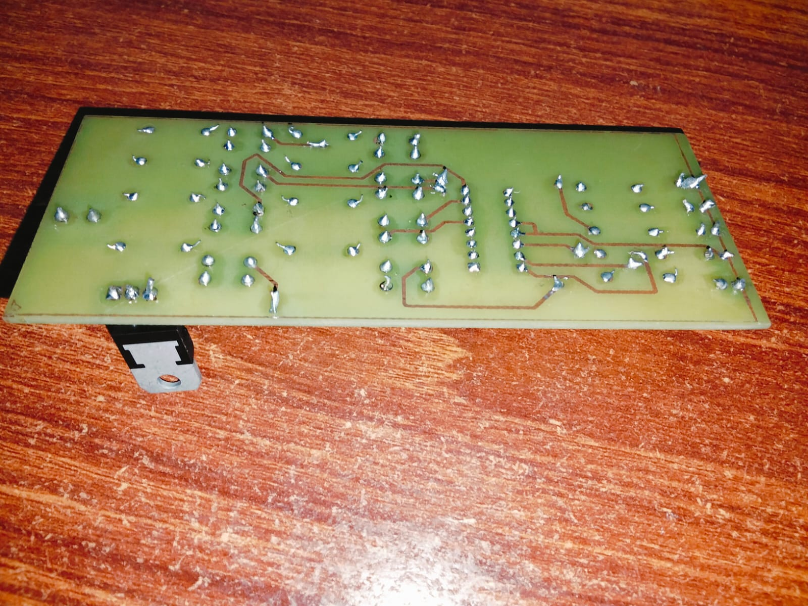

# 4-Bit Ripple Carry Adder — Custom PCB

A fully realized hardware project: schematic → PCB layout → simulation → physical board.

Designed as part of **EE-272 Digital Logic** at **UET Lahore (2024-EE-264/265/274)**.

---

## 📸 Project Gallery

| PCB Layout (EasyEDA) | Schematic | Physical Board (Top) | Physical Board (Bottom) |
|---|---|---|---|
|  |  |  |  |

---

## ⚙️ How It Works

A **Ripple Carry Adder** chains multiple full adders in series. The carry-out of each stage feeds into the carry-in of the next — hence "ripple." This board implements a 4-bit version using a single **CD74HC283E** IC.

```
A3 A2 A1 A0
B3 B2 B1 B0
         ↓
[FA3]←[FA2]←[FA1]←[FA0] ← Cin (GND)
  ↓     ↓     ↓     ↓
  S3    S2    S1    S0
  ↓
Cout (LED)
```

- **Inputs**: 8 push-buttons (A0–A3, B0–B3) with 10kΩ pull-down resistors
- **Outputs**: 4 LEDs for sum bits (S0–S3) + 1 LED for carry-out (Cout)
- **Power**: 5V regulated via LM7805 from external supply through XH-2A connector

---

## 🧰 Bill of Materials (BOM)

| Ref | Component | Value / Part No. | Qty |
|-----|-----------|-----------------|-----|
| U1 | 4-bit Binary Full Adder | CD74HC283E | 1 |
| U2 | Voltage Regulator | LM7805T | 1 |
| SW1–SW8 | Tactile Push Button | PB-22E86C | 8 |
| R1–R8 | Pull-down Resistor | 10kΩ | 8 |
| R9–R13 | Current Limiting Resistor | 220Ω | 5 |
| R14 | Power LED Resistor | 330Ω | 1 |
| S0–S3 | Sum Output LEDs | Red/Yellow/Green | 4 |
| Cout | Carry Output LED | Green | 1 |
| Power LED | Power Indicator | Red | 1 |
| CN1 | Power Connector | XH-2A | 1 |

---

## 🛠️ Tools Used

| Stage | Tool |
|-------|------|
| Schematic Capture | [EasyEDA](https://easyeda.com) |
| PCB Layout | EasyEDA |
| Logic Simulation | Proteus 8 |
| Fabrication | DIY (etched/manufactured locally) |
| Soldering | Manual through-hole |

---

## 📁 Repository Structure

```
ripple-carry-adder-pcb/
│
├── README.md
├── schematic/
│   └── Ripple_Carry_Adder_Schematic.json   # EasyEDA schematic export
├── pcb/
│   └── Ripple_Carry_Adder_PCB.json         # EasyEDA PCB layout export
├── gerbers/
│   └── *.gbr / *.drl                        # Gerber files for fabrication
├── simulation/
│   └── ripple_carry_adder.pdsprj            # Proteus simulation file
└── images/
    ├── schematic.png
    ├── pcb_layout.png
    ├── board_top.jpg
    └── board_bottom.jpg
```

---

## 🚀 How to Use

### Open Schematic / PCB in EasyEDA
1. Go to [EasyEDA.com](https://easyeda.com) → Open Project
2. Import the `.json` file from `schematic/` or `pcb/`

### Run Simulation in Proteus
1. Open Proteus 8
2. Load `simulation/ripple_carry_adder.pdsprj`
3. Press play — toggle input switches to verify sum and carry outputs

### Fabricate the PCB
1. Use Gerber files in `gerbers/` folder
2. Upload to any PCB manufacturer (JLCPCB, PCBWay, etc.)
3. Standard 2-layer, 1.6mm FR4 board settings work

---

## 📐 Design Notes

- **Layer stack**: 2-layer (top = red traces, bottom = blue traces in EasyEDA view)
- **IC socket**: Recommended for U1 (CD74HC283E) to allow easy replacement
- **Power input**: 7–12V DC into CN1 → regulated to 5V by LM7805
- **Logic family**: 74HC (High-speed CMOS) — operates at 5V, compatible with TTL levels

---

## 👤 Author

**Shehroz** — Electrical Engineering Student (Computer Track), UET Lahore  
Batch 2024 | EE-272 Digital Logic Systems

---

## 📄 License

This project is open-source under the [MIT License](LICENSE).  
Feel free to use, modify, and build upon it.
